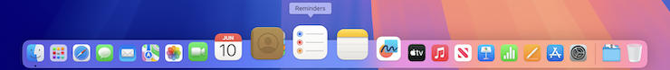

# Magnification size

Set the icon size of magnified Dock items in pixels.

- **Tested on macOS**:
  - Seqoia
- **Parameter type**: int

## Requirements

This setting will have no effect unless the following conditions are met:

- [`com.apple.dock magnification`](/dock/magnification.md#set-to-true) must be set to `true`
- The set size must be greater than the value of [`com.apple.dock tilesize`](/dock/tilesize.md)

## Set to `96` (default value)

Magnified Dock icon size of 96 pixels.

```bash
defaults write com.apple.dock "largesize" -int "96" && killall Dock
```



## Set to `76`

Magnified Dock icon size of 76 pixels.

```bash
defaults write com.apple.dock "largesize" -int "76" && killall Dock
```


## Read current value

```bash
defaults read com.apple.dock "largesize"
```

## Reset to default value

```bash
defaults delete com.apple.dock "largesize" && killall Dock
```

## Set value from UI

1. <a href="x-apple.systempreferences:com.apple.preference.dock?Dock">Access Dock settings from macOS UI</a>
2. Slide "Magnification" range value
