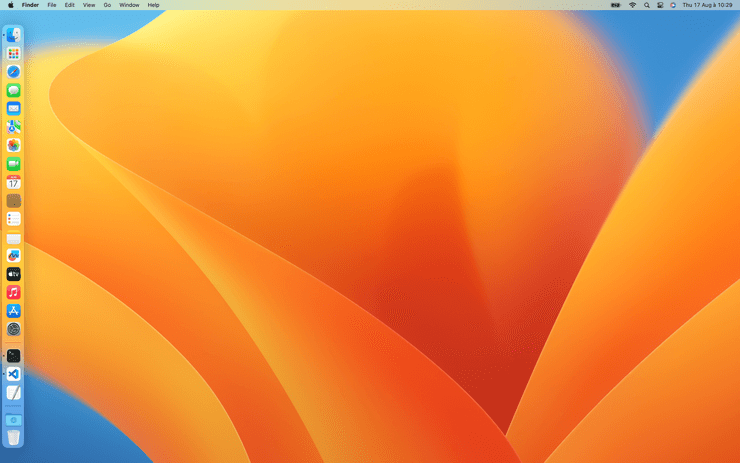
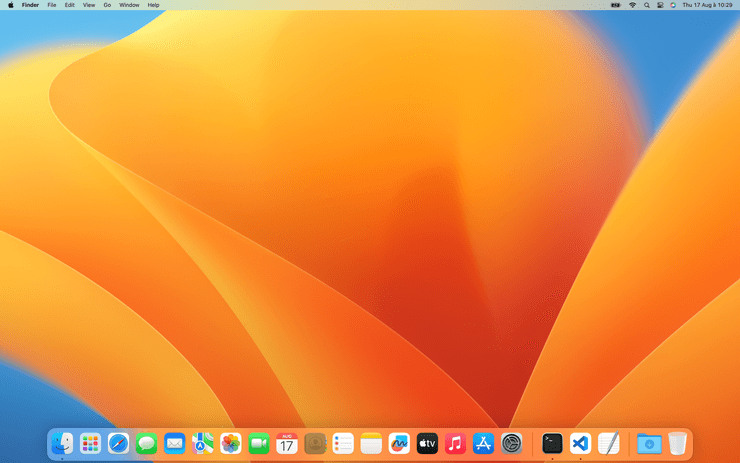
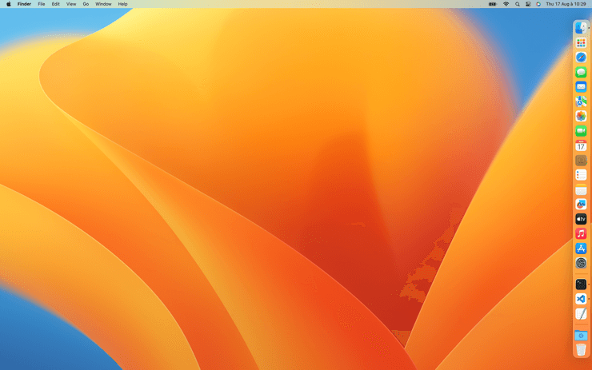

# Position

Set the Dock position

- **Tested on macOS**:
  - Sonoma
  - Ventura
  - Monterey
  - Big Sur
  - Catalina
  - Mojave
- **Parameter type**: string
  - left
  - bottom
  - right

## Set to `left`

Put the Dock on the left of the screen

```bash
defaults write com.apple.dock "orientation" -string "left" && killall Dock
```



## Set to `bottom` (default value)

Put the Dock on the bottom of the screen

```bash
defaults write com.apple.dock "orientation" -string "bottom" && killall Dock
```



## Set to `right`

Put the Dock on the right of the screen

```bash
defaults write com.apple.dock "orientation" -string "right" && killall Dock
```



## Read current value

```bash
defaults read com.apple.dock "orientation"
```

## Reset to default value

```bash
defaults delete com.apple.dock "orientation" && killall Dock
```

## Set value from UI

1. <a href="x-apple.systempreferences:com.apple.preference.dock?Dock">Access Dock settings from macOS UI</a>
2. Set "Position on the screen" dropdown value
