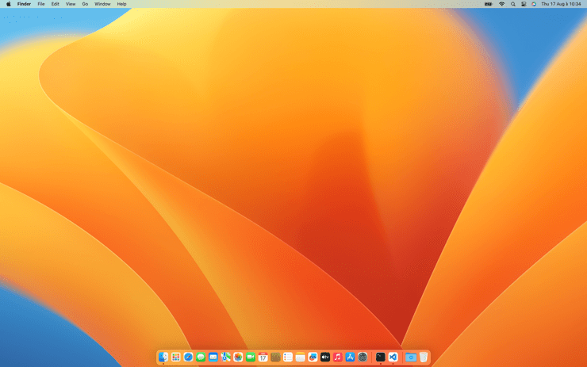

# Change macOS Dock icon size

Set the icon size of Dock items in pixels.

<!-- break lists -->

- **Tested on macOS**:
  - Ventura
  - Monterey
  - Big Sur
  - Catalina
- **Parameter type**: int

## Set to `36`

Dock icon size of 36 pixels.

```bash
defaults write com.apple.dock "tilesize" -int "36" && killall Dock
```



## Set to `48` (default value)

Dock icon size of 48 pixels.

```bash
defaults write com.apple.dock "tilesize" -int "48" && killall Dock
```


## Read current value

```bash
defaults read com.apple.dock "tilesize"
```

## Reset to default value

```bash
defaults delete com.apple.dock "tilesize" && killall Dock
```
