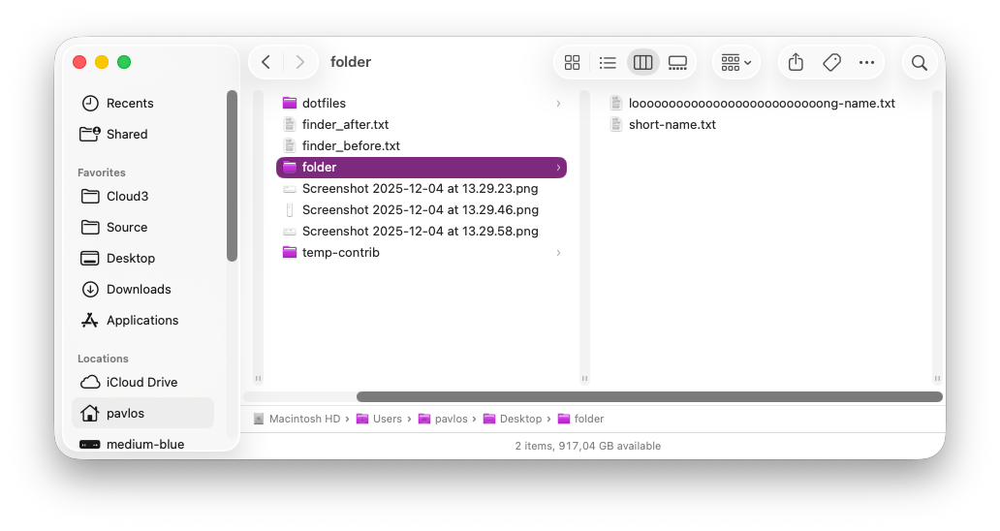
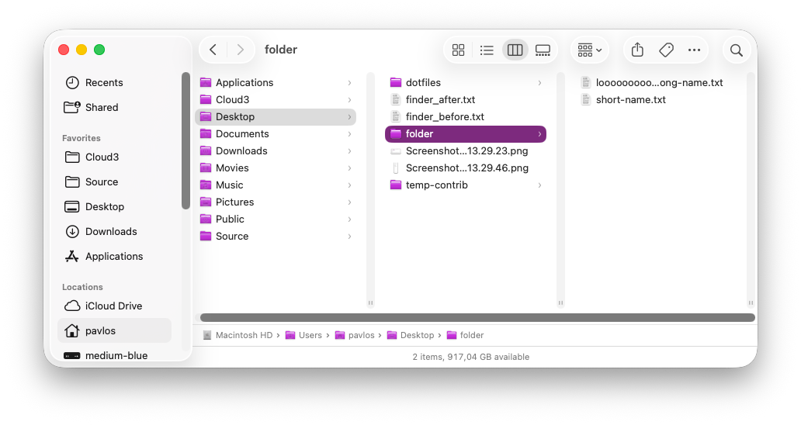

# Column auto sizing

Automatically adjust column widths in column view to fit the longest filename visible in each column.

- **Tested on macOS**:
  - Tahoe
- **Parameter type**: bool

## Set to `true`

Columns automatically resize to fit content

```bash
defaults write com.apple.finder "_FXEnableColumnAutoSizing" -bool "true" && killall Finder
```



## Set to `false` (default value)

Columns use fixed width

```bash
defaults write com.apple.finder "_FXEnableColumnAutoSizing" -bool "false" && killall Finder
```



## Read current value

```bash
defaults read com.apple.finder "_FXEnableColumnAutoSizing"
```

## Reset to default value

```bash
defaults delete com.apple.finder "_FXEnableColumnAutoSizing" && killall Finder
```

## Set value from UI

1. Open a Finder window
2. Switch to column view (<kbd>Cmd</kbd> + <kbd>3</kbd>)
3. Press <kbd>Cmd</kbd> + <kbd>J</kbd> to open View Options
4. Toggle "Resize columns to fit filenames"
