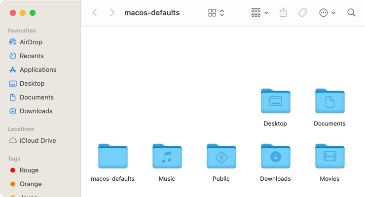
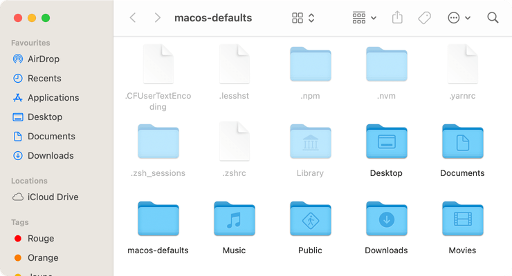

# Show hidden files

Show hidden files in the Finder. You can toggle the value using `⌘ cmd`+`⇧ shift`+`.`.

<!-- break lists -->

- **Tested on macOS**:
  - Ventura
  - Monterey
  - Big Sur
  - Catalina
- **Parameter type**: bool

## Set to `false` (default value)

Do not show hidden files inside the Finder

```bash
defaults write com.apple.finder "AppleShowAllFiles" -bool "false" && killall Finder
```



## Set to `true`

Show hidden files inside the Finder

```bash
defaults write com.apple.finder "AppleShowAllFiles" -bool "true" && killall Finder
```



## Read current value

```bash
defaults read com.apple.finder "AppleShowAllFiles"
```

## Reset to default value

```bash
defaults delete com.apple.finder "AppleShowAllFiles" && killall Finder
```
