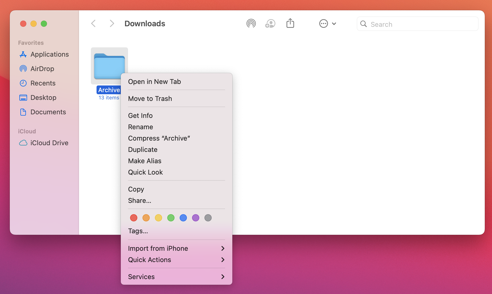
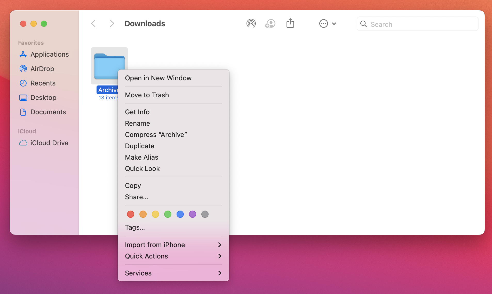

# Open folders destination

Set whether folders shown in the Finder open in a new tab or a new window when using `⌘ cmd`+`double-click`, and which option is shown in the context menu.

- **Tested on macOS**:
  - Sonoma
- **Parameter type**: bool

## Set to `true` (default value)

Open folders in a new tab

```bash
defaults write com.apple.finder "FinderSpawnTab" -bool "true" && killall Finder
```



## Set to `false`

Open folders in a new window

```bash
defaults write com.apple.finder "FinderSpawnTab" -bool "false" && killall Finder
```



## Read current value

```bash
defaults read com.apple.finder "FinderSpawnTab"
```

## Reset to default value

```bash
defaults delete com.apple.finder "FinderSpawnTab" && killall Finder
```

## Set value from UI

1. Access Finder settings from macOS UI
2. Toggle "Open folders in tabs instead of new windows" value
