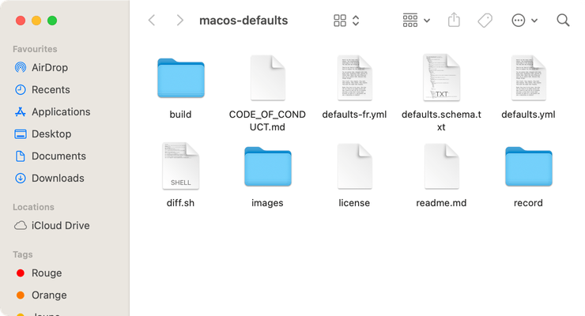
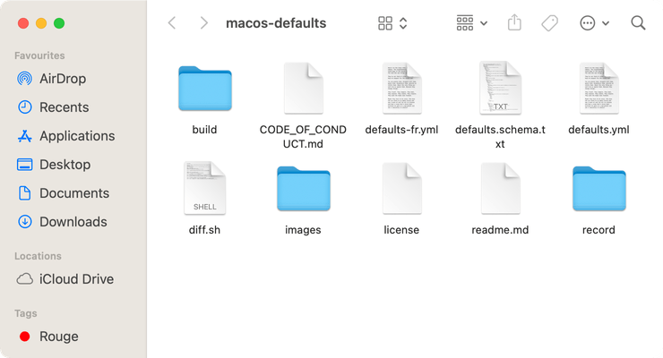

# Sidebar icon size

Choose the size of Finder sidebar icons

<!-- break lists -->

- **Tested on macOS**:
  - Sonoma
  - Ventura
  - Monterey
  - Big Sur
  - Catalina
- **Parameter type**: int

## Set to `1`

Small

```bash
defaults write NSGlobalDomain "NSTableViewDefaultSizeMode" -int "1" && killall Finder
```


## Set to `2` (default value)

Medium

```bash
defaults write NSGlobalDomain "NSTableViewDefaultSizeMode" -int "2" && killall Finder
```



## Set to `3`

Large

```bash
defaults write NSGlobalDomain "NSTableViewDefaultSizeMode" -int "3" && killall Finder
```



## Read current value

```bash
defaults read NSGlobalDomain "NSTableViewDefaultSizeMode"
```

## Reset to default value

```bash
defaults delete NSGlobalDomain "NSTableViewDefaultSizeMode" && killall Finder
```
