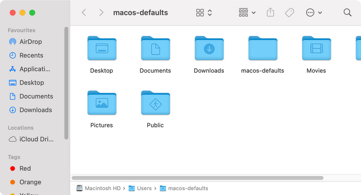
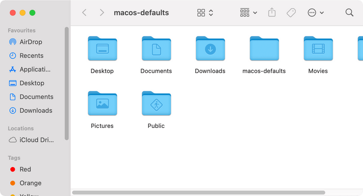

# Path bar

Show path bar in the bottom of the Finder windows

<!-- break lists -->

- **Tested on macOS**:
  - Ventura
  - Monterey
  - Big Sur
- **Parameter type**: bool

## Set to `true`

Show path bar

```bash
defaults write com.apple.finder "ShowPathbar" -bool "true" && killall Finder
```



## Set to `false` (default value)

Hide path bar

```bash
defaults write com.apple.finder "ShowPathbar" -bool "false" && killall Finder
```



## Read current value

```bash
defaults read com.apple.finder "ShowPathbar"
```

## Reset to default value

```bash
defaults delete com.apple.finder "ShowPathbar" && killall Finder
```
