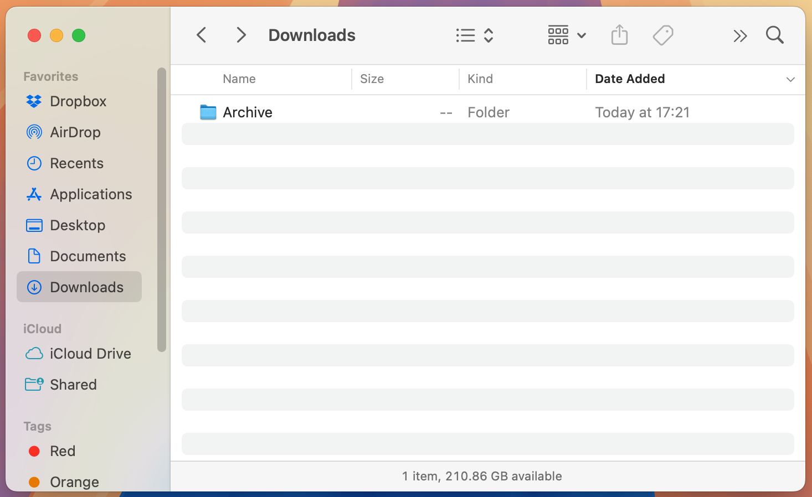
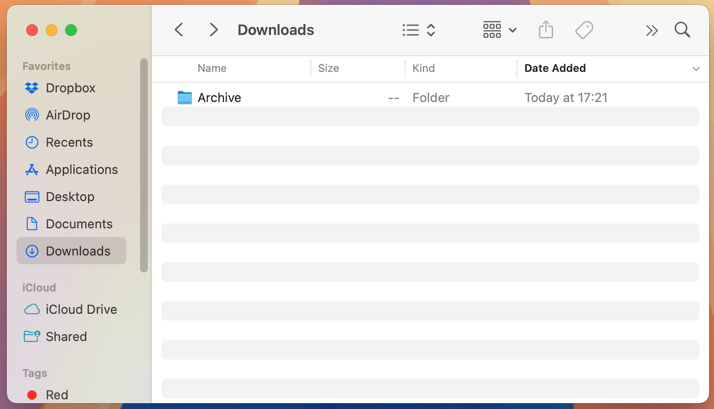

# Status bar

Show status bar in the bottom of the Finder windows

- **Tested on macOS**:
  - Sequoia
- **Parameter type**: bool

## Set to `true`

Show path bar

```bash
defaults write com.apple.finder "ShowStatusBar" -bool "true" && killall Finder
```



## Set to `false` (default value)

Hide path bar

```bash
defaults write com.apple.finder "ShowStatusBar" -bool "false" && killall Finder
```



## Read current value

```bash
defaults read com.apple.finder "ShowStatusBar"
```

## Reset to default value

```bash
defaults delete com.apple.finder "ShowStatusBar" && killall Finder
```
