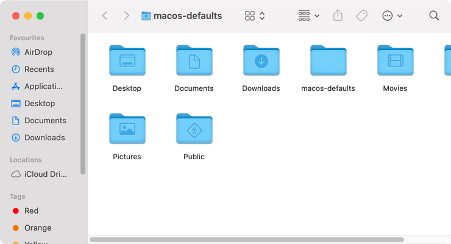

# Title bar icons

Always show folder icon before title in the title bar

⚠️ This command requires to grant full disk access to the terminal
(System Preferences → Security & Privacy → Full Disk Access)

<!-- break lists -->

- **Tested on macOS**:
  - Ventura
  - Monterey
- **Parameter type**: bool

## Set to `true`

Show icon in the title bar

```bash
defaults write com.apple.universalaccess "showWindowTitlebarIcons" -bool "true" && killall Finder
```



## Set to `false` (default value)

Hide icon from the title bar

```bash
defaults write com.apple.universalaccess "showWindowTitlebarIcons" -bool "false" && killall Finder
```


## Read current value

```bash
defaults read com.apple.universalaccess "showWindowTitlebarIcons"
```

## Reset to default value

```bash
defaults delete com.apple.universalaccess "showWindowTitlebarIcons" && killall Finder
```
