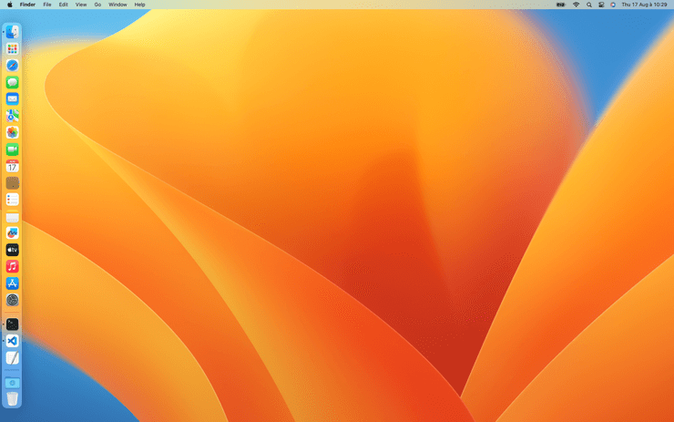
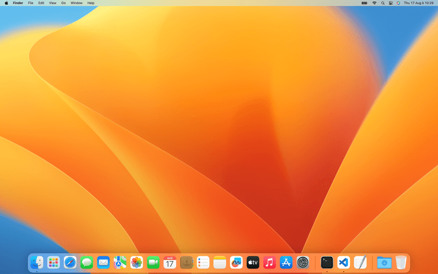
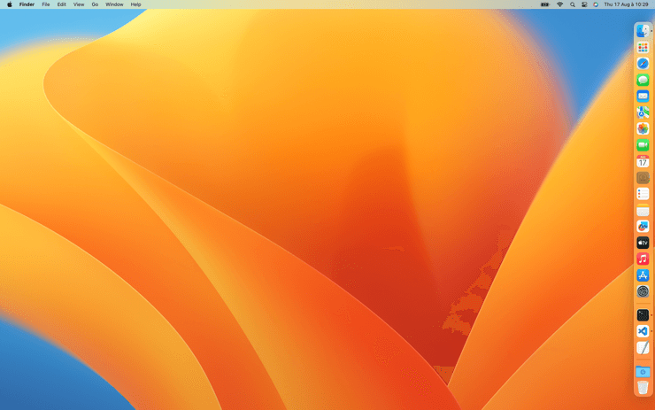

# Position

Choisir la position du Dock

<!-- break lists -->

- **Testé sur macOS**:
  - Ventura
  - Monterey
  - Big Sur
  - Catalina
  - Mojave
- **Type de paramètre**: string
  - left
  - bottom
  - right

## Avec la valeur `left`

Placer le Dock sur la gauche de l'écran

```bash
defaults write com.apple.dock "orientation" -string "left" && killall Dock
```



## Avec la valeur `bottom` (par défaut)

Placer le Dock en bas de l'écran

```bash
defaults write com.apple.dock "orientation" -string "bottom" && killall Dock
```



## Avec la valeur `right`

Placer le Dock sur la droite de l'écran

```bash
defaults write com.apple.dock "orientation" -string "right" && killall Dock
```



## Lire la valeur courante

```bash
defaults read com.apple.dock "orientation"
```

## Remettre la valeur à l'état initial

```bash
defaults delete com.apple.dock "orientation" && killall Dock
```
