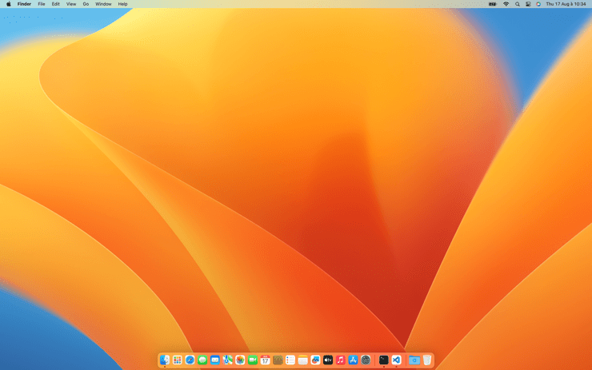
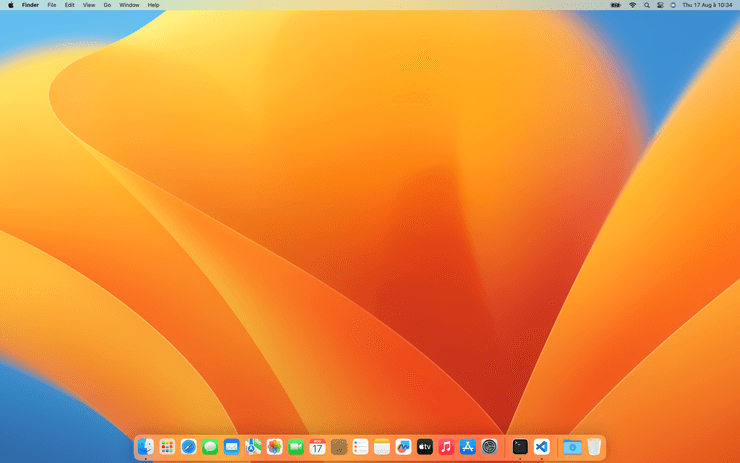

# Taille des icônes

Paramétrer le taille des icônes du Dock

<!-- break lists -->

- **Testé sur macOS**:
  * Ventura
  * Monterey
  * Big Sur
  * Catalina
- **Type de paramètre**: int

## Avec la valeur `36`

Taille des icônes du Dock de 36 pixels

```bash
defaults write com.apple.dock "tilesize" -int "36" && killall Dock
```


## Avec la valeur `48` (par défaut)

Taille des icônes du Dock de 48 pixels

```bash
defaults write com.apple.dock "tilesize" -int "48" && killall Dock
```


## Lire la valeur courante
```bash
defaults read com.apple.dock "tilesize"
```

## Remettre la valeur à l'état initial
```bash
defaults delete com.apple.dock "tilesize" && killall Dock
```
