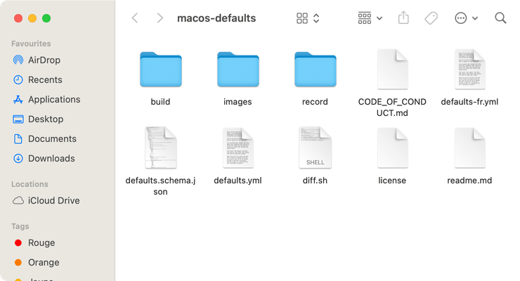
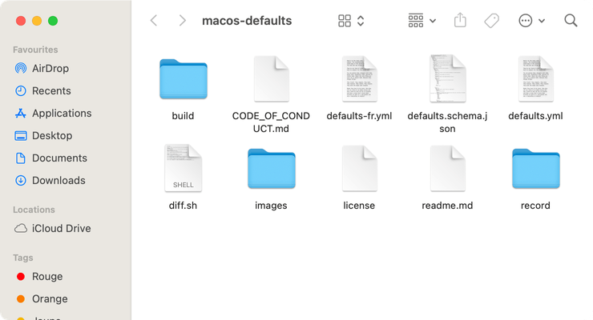

# Laisser les dossiers en haut

Laisser les dossiers en haut lors d'un tri par nom.

<!-- break lists -->

- **Testé sur macOS**:
  * Ventura
  * Monterey
  * Big Sur
- **Type de paramètre**: bool

## Avec la valeur `true`

Laisse les dossiers en haut

```bash
defaults write com.apple.finder "_FXSortFoldersFirst" -bool "true" && killall Finder
```


## Avec la valeur `false` (par défaut)

Ne laisse pas les dossiers en haut

```bash
defaults write com.apple.finder "_FXSortFoldersFirst" -bool "false" && killall Finder
```


## Lire la valeur courante
```bash
defaults read com.apple.finder "_FXSortFoldersFirst"
```

## Remettre la valeur à l'état initial
```bash
defaults delete com.apple.finder "_FXSortFoldersFirst" && killall Finder
```
