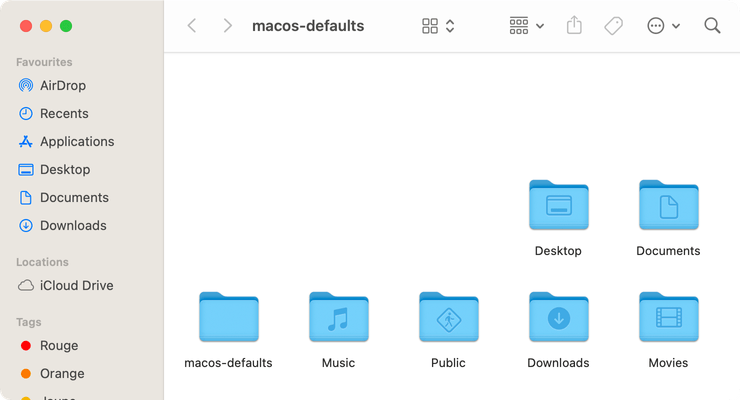
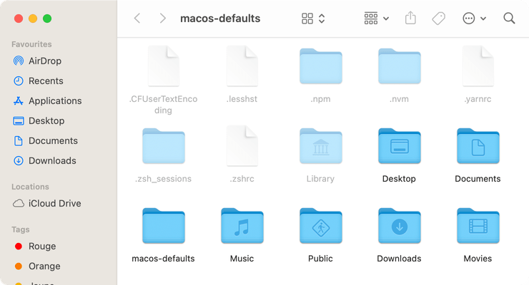

# Afficher les fichiers cachés

Afficher les fichiers cachés dans le Finder.

<!-- break lists -->

- **Testé sur macOS**:
  - Ventura
  - Monterey
  - Big Sur
  - Catalina
- **Type de paramètre**: bool

## Avec la valeur `false` (par défaut)

Ne pas afficher les fichiers cachés dans le Finder

```bash
defaults write com.apple.finder "AppleShowAllFiles" -bool "false" && killall Finder
```



## Avec la valeur `true`

Afficher les fichiers cachés dans le Finder

```bash
defaults write com.apple.finder "AppleShowAllFiles" -bool "true" && killall Finder
```



## Lire la valeur courante

```bash
defaults read com.apple.finder "AppleShowAllFiles"
```

## Remettre la valeur à l'état initial

```bash
defaults delete com.apple.finder "AppleShowAllFiles" && killall Finder
```
