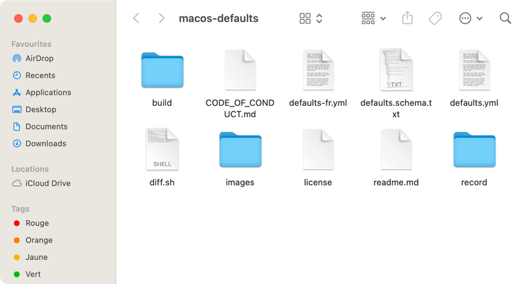

# Taille des icônes de la barre latérale

Personnaliser la taille des icônes dans la barre latérale du Finder

<!-- break lists -->

- **Testé sur macOS**:
  - Ventura
  - Monterey
  - Big Sur
  - Catalina
- **Type de paramètre**: int

## Avec la valeur `1`

Petites

```bash
defaults write NSGlobalDomain "NSTableViewDefaultSizeMode" -int "1" && killall Finder
```



## Avec la valeur `2` (par défaut)

Moyennes

```bash
defaults write NSGlobalDomain "NSTableViewDefaultSizeMode" -int "2" && killall Finder
```


## Avec la valeur `3`

Grosses

```bash
defaults write NSGlobalDomain "NSTableViewDefaultSizeMode" -int "3" && killall Finder
```


## Lire la valeur courante

```bash
defaults read NSGlobalDomain "NSTableViewDefaultSizeMode"
```

## Remettre la valeur à l'état initial

```bash
defaults delete NSGlobalDomain "NSTableViewDefaultSizeMode" && killall Finder
```
