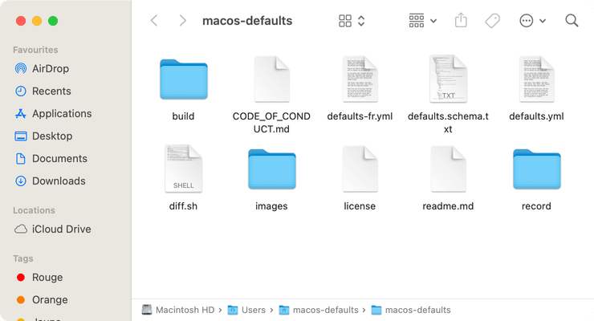
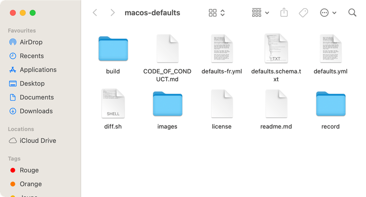

# Barre du chemin d'accès

Afficher la barre du chemin d'accès en bas de la fenêtre du Finder.

<!-- break lists -->

- **Testé sur macOS**:
  - Ventura
  - Monterey
  - Big Sur
- **Type de paramètre**: bool

## Avec la valeur `true`

Afficher la barre du chemin d'accès

```bash
defaults write com.apple.finder "ShowPathbar" -bool "true" && killall Finder
```



## Avec la valeur `false` (par défaut)

Masquer la barre du chemin d'accès

```bash
defaults write com.apple.finder "ShowPathbar" -bool "false" && killall Finder
```



## Lire la valeur courante

```bash
defaults read com.apple.finder "ShowPathbar"
```

## Remettre la valeur à l'état initial

```bash
defaults delete com.apple.finder "ShowPathbar" && killall Finder
```
