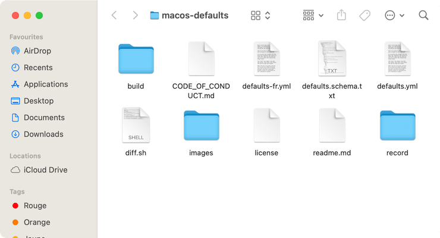

# Icône de la barre de titre

Toujours afficher l'icône du dossier avant le titre dans la barre de titre.

⚠️ Cette commande nécessite d'accorder au terminal un accès complet au disque.
(Préférences Système → Sécurité et confidentialité → Accès complet au disque).

<!-- break lists -->

- **Testé sur macOS**:
  - Ventura
  - Monterey
- **Type de paramètre**: bool

## Avec la valeur `true`

Affiche l'icône dans la barre de titre

```bash
defaults write com.apple.universalaccess "showWindowTitlebarIcons" -bool "true" && killall Finder
```



## Avec la valeur `false` (par défaut)

Masque l'icône de la barre de titre

```bash
defaults write com.apple.universalaccess "showWindowTitlebarIcons" -bool "false" && killall Finder
```


## Lire la valeur courante

```bash
defaults read com.apple.universalaccess "showWindowTitlebarIcons"
```

## Remettre la valeur à l'état initial

```bash
defaults delete com.apple.universalaccess "showWindowTitlebarIcons" && killall Finder
```
