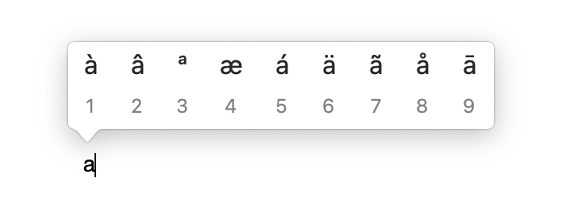

# Comportement touche maintenue enfoncée

Permet de choisir le comportement lorsque l'on maintient une touche enfoncée. Les deux comportements possibles sont:

- affiche le menu des accents (par défaut)
- écris le caractère tant qu'il est pressé

⚠️ Il est nécessaire de redémarrer le mac, fermer la session ou relancer l'application pour prendre en compte les
changements.

<!-- break lists -->

- **Testé sur macOS**:
  - Ventura
  - Monterey
  - Big Sur
- **Type de paramètre**: bool

## Avec la valeur `true` (par défaut)

Par défaut, lorsqu'une touche est maintenue enfoncée, le menu des accents s'affiche.

```bash
defaults write NSGlobalDomain "ApplePressAndHoldEnabled" -bool "true"
```



## Avec la valeur `false`

Répète la touche tant que celle-ci est maintenue enfoncée.

```bash
defaults write NSGlobalDomain "ApplePressAndHoldEnabled" -bool "false"
```


## Lire la valeur courante

```bash
defaults read NSGlobalDomain "ApplePressAndHoldEnabled"
```

## Remettre la valeur à l'état initial

```bash
defaults delete NSGlobalDomain "ApplePressAndHoldEnabled"
```
