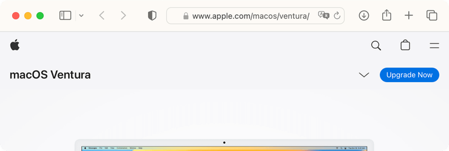

::: warning Attention
La langue française n'est plus supportée sur macos-defaults.com. Cette page redirigera automatiquement vers la version anglaise correspondante en 2024.
:::

# Afficher l'URL complète

Afficher l'adresse des sites web en entier.

<!-- break lists -->

- **Testé sur macOS**:
  - Monterey
- **Type de paramètre**: bool

## Avec la valeur `true`

Affiche l'URL complète des sites web.

```bash
defaults write com.apple.Safari "ShowFullURLInSmartSearchField" -bool "true" && killall Safari
```



## Avec la valeur `false` (par défaut)

N'affiche pas l'URL complète des sites web.

```bash
defaults write com.apple.Safari "ShowFullURLInSmartSearchField" -bool "false" && killall Safari
```


## Lire la valeur courante

```bash
defaults read com.apple.Safari "ShowFullURLInSmartSearchField"
```

## Remettre la valeur à l'état initial

```bash
defaults delete com.apple.Safari "ShowFullURLInSmartSearchField" && killall Safari
```
