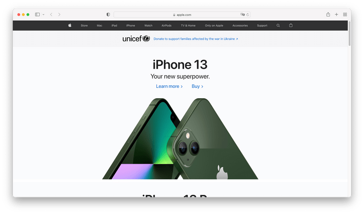
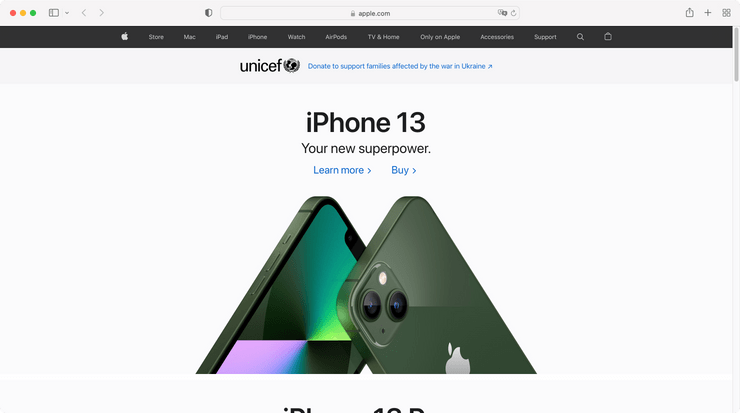

# Enlever l'ombre

Afficher ou non une ombre en prenant une capture d'une app (`⌘ cmd`+`⇧ shift`+`4` puis `espace`).

<!-- break lists -->

- **Testé sur macOS**:
  - Ventura
  - Monterey
  - Big Sur
  - Catalina
- **Type de paramètre**: bool

## Avec la valeur `false` (par défaut)

Ajouter l'ombre aux captures

```bash
defaults write com.apple.screencapture "disable-shadow" -bool "false"
```



## Avec la valeur `true`

Supprimer l'ombre des captures

```bash
defaults write com.apple.screencapture "disable-shadow" -bool "true"
```



## Lire la valeur courante

```bash
defaults read com.apple.screencapture "disable-shadow"
```

## Remettre la valeur à l'état initial

```bash
defaults delete com.apple.screencapture "disable-shadow"
```
