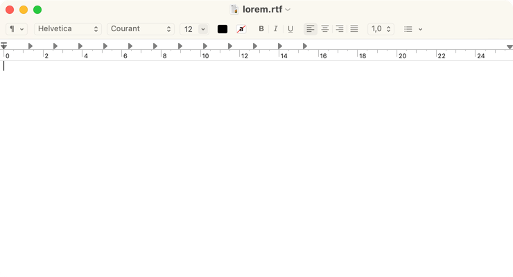
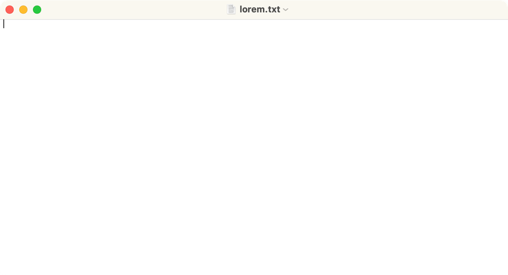

::: warning Attention
La langue française n'est plus supportée sur macos-defaults.com. Cette page redirigera automatiquement vers la version anglaise correspondante en 2024.
:::

# Définir le format de document par défaut

Définir le format de document par défaut comme texte enrichi (.rtf) ou texte brut (.txt).

<!-- break lists -->

- **Testé sur macOS**:
  - Ventura
  - Monterey
  - Big Sur
- **Type de paramètre**: bool

## Avec la valeur `true` (par défaut)

Texte enrichi activé.

```bash
defaults write com.apple.TextEdit "RichText" -bool "true" && killall TextEdit
```



## Avec la valeur `false`

Texte enrichi désactivé.

```bash
defaults write com.apple.TextEdit "RichText" -bool "false" && killall TextEdit
```



## Lire la valeur courante

```bash
defaults read com.apple.TextEdit "RichText"
```

## Remettre la valeur à l'état initial

```bash
defaults delete com.apple.TextEdit "RichText" && killall TextEdit
```
