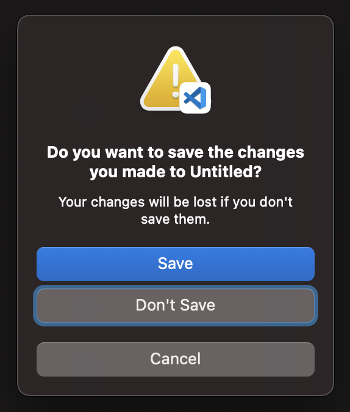

# Keyboard navigation

Choose whether to enable moving focus with Tab and Shift Tab.

- **Tested on macOS**:
  - Sonoma
  - Sequoia
- **Parameter type**: int
  - 0
  - 2

## Set to: Disabled (default)

```bash
defaults write NSGlobalDomain AppleKeyboardUIMode -int "0"
```


## Set to: Enabled

```bash
defaults write NSGlobalDomain AppleKeyboardUIMode -int "2"
```



## Read current value

```bash
defaults read NSGlobalDomain AppleKeyboardUIMode
```

## Reset to default value

```bash
defaults delete NSGlobalDomain AppleKeyboardUIMode
```

## Set value from UI

1. <a href="x-apple.systempreferences:com.apple.preference.keyboard">Open the Keyboard preference pane in System Preferences</a>
2. Toggle "Keyboard navigation"
