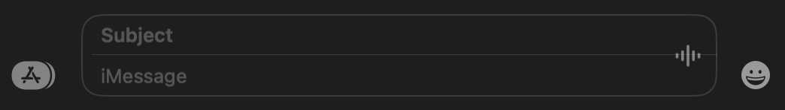

# Show Subject Field 

Show the subject field which appears above the iMessage/Text Message field in Messages. Text entered in the subject field will be sent in bold (unless there is no text in the iMessage/Text Message field; in this case, the text in the subject field will be sent without the bold effect).

<!-- break lists -->

- **Tested on macOS**:
  - Sonoma
- **Parameter type**: bool

## Set to `true`

Show the subject field in Messages

```bash
defaults write com.apple.MobileSMS "MMSShowSubject" -bool "true" && killall Messages
```



## Set to `false` (default value)

Hide the subject field in Messages

```bash
defaults write com.apple.MobileSMS "MMSShowSubject" -bool "false" && killall Messages
```


## Read current value

```bash
defaults read com.apple.MobileSMS "MMSShowSubject"
```

## Reset to default value

```bash
defaults delete com.apple.MobileSMS "MMSShowSubject" && killall Messages
```
