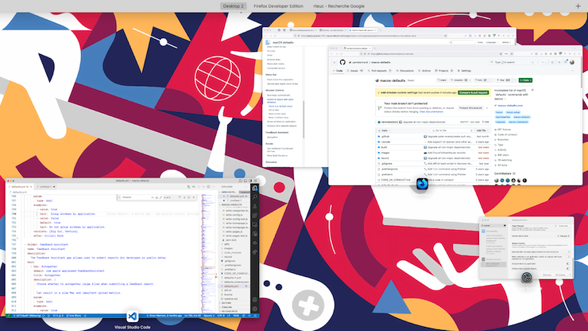
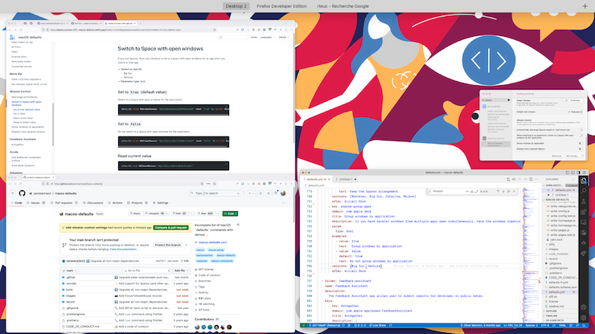

# Group windows by application

If you have several windows from multiple apps open simultaneously, have the windows organised by app in
Mission Control.

<!-- break lists -->

- **Tested on macOS**:
  - Sonoma
  - Ventura
  - Big Sur
- **Parameter type**: bool

## Set to `true`

Group windows by application.

```bash
defaults write com.apple.dock "expose-group-apps" -bool "true" && killall Dock
```



## Set to `false` (default value)

Do not group windows by application.

```bash
defaults write com.apple.dock "expose-group-apps" -bool "false" && killall Dock
```



## Read current value

```bash
defaults read com.apple.dock "expose-group-apps"
```

## Reset to default value

```bash
defaults delete com.apple.dock "expose-group-apps" && killall Dock
```

## Set value from UI

1. <a href="x-apple.systempreferences:com.apple.preference.dock?WindowsApps">Access Dock settings from macOS UI</a>
2. Toggle "Group windows by application" value
