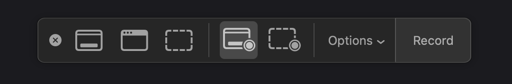
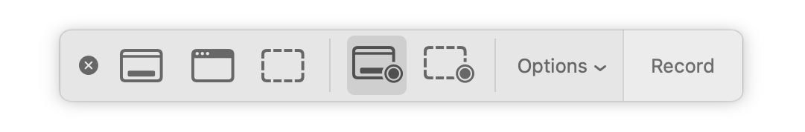

# Screenshots

On a Mac, you can take screenshots using:

- `⌘ cmd`+`⇧ shift`+`3` for fullscreen.
- `⌘ cmd`+`⇧ shift`+`4` for a selection. Then use `space` to capture an entire app.
- `⌘ cmd`+`⇧ shift`+`5` to open the Screenshot app.

There are a few keys you can customize.

## Keys

<FolderTableOfContents />
