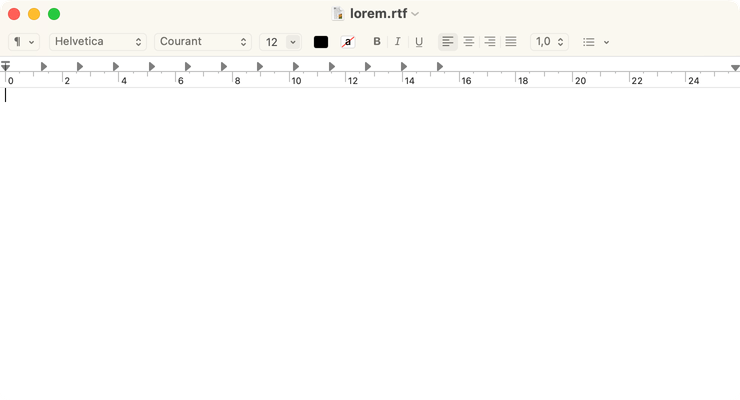

# Set default document format

Set default document format as rich text (.rtf) or plain text (.txt).

<!-- break lists -->

- **Tested on macOS**:
  - Ventura
  - Monterey
  - Big Sur
- **Parameter type**: bool

## Set to `true` (default value)

Rich text is enabled.

```bash
defaults write com.apple.TextEdit "RichText" -bool "true" && killall TextEdit
```



## Set to `false`

Rich text is disabled.

```bash
defaults write com.apple.TextEdit "RichText" -bool "false" && killall TextEdit
```


## Read current value

```bash
defaults read com.apple.TextEdit "RichText"
```

## Reset to default value

```bash
defaults delete com.apple.TextEdit "RichText" && killall TextEdit
```
